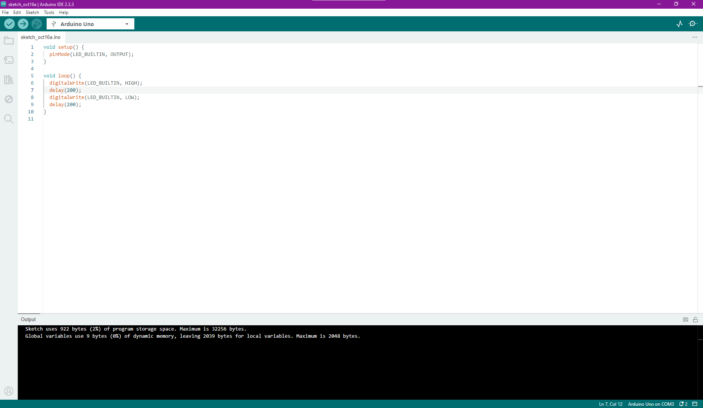

# Parte 1: Blink Led Interno

 Entrega Parte 1: em seu GitHub pessoal (usando sua conta com email Inteli), inserir screenshots de sua tela com o IDE e seu código, além de uma fotografia que demonstre seu Arduino ligado no computador e o seu led aceso. Você também poderá enviar um vídeo que evidencie esse funcionamento.

O objetivo principal é fazer o LED interno da placa Arduino piscar em um intervalo definido. Para fazer isso, utilizamos o LED embutido da placa do Arduino e um código para alternar entre acender e apagar o LED, criando um efeito de "piscar".

## Funcionalidade do Código

O código utilizado possui duas funções principais: `setup()` e `loop()`.
- **setup()**: Esta função é executada uma única vez quando o Arduino é ligado ou reiniciado. Aqui, definimos que a saída do nosso código vai ser no LED.
- **loop()**: Esta função é chamada repetidamente para que o led fique "piscando". Dentro dela, utilizamos comandos para acender e apagar o LED, intercalados com períodos de espera (delay) que definem quanto tempo o LED permanecerá aceso ou apagado.

O código para implementar essa funcionalidade é:

Desenvolvimento do Código 
 
Fonte: Material produzido pelos autores (2024)

Neste exemplo, temos um loop contínuo do LED "piscando"

## Demonstração

Para registrar o funcionamento do código na placa do arduíno, segue uma foto e um link para um vídeo de demonstração:

https://drive.google.com/file/d/1HpYFcbjvz4N0oVhDT8ceQ7HdKFbHl4eW/view?usp=sharing

# Parte 2: Simulando Blink Externo

Demonstração da simulação no TinkerCad com uma montagem do pisca-pisca com Arduino Uno. Ao clicar no play do TinkerCad, o projeto deve executar sem erros uma rotina que simula um pisca-pisca de qualquer cadência. 

https://drive.google.com/file/d/1-ZaSMNU_EZoxay1nwPnVseKyeYpHybQw/view?usp=sharing

